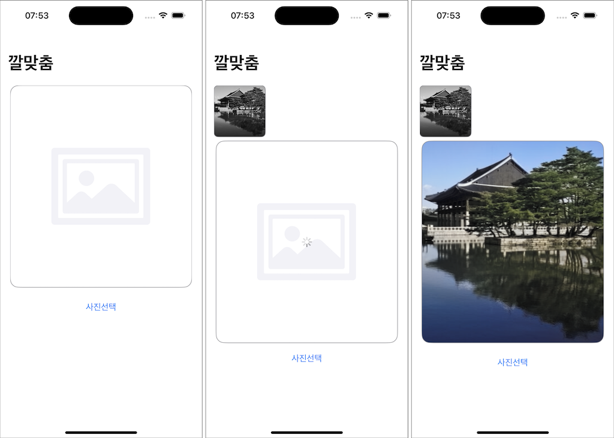

# ColorFit (깔맞춤)

### Screenshot

### ML Model

- Converted by [coremltools](https://github.com/apple/coremltools)
- Original Model : https://github.com/richzhang/colorization
    - Forked for converting : https://github.com/iamchiwon/colorization
- Image pre/post processing : https://github.com/sgl0v/ImageColorizer

### Features

- 사진첩 이미지 읽어오기
- 흑백 이미지를 컬러 이미지로 변경
