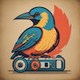
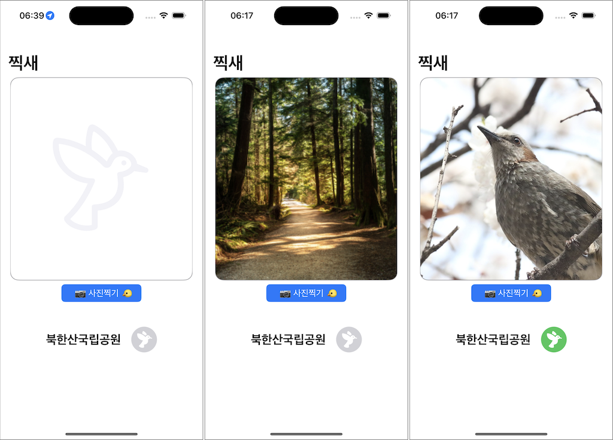

# ParkBirdie (찍새)

### Motivation

### Screenshot

### ML Model

- ML Models (https://developer.apple.com/kr/machine-learning/models/)
- Object Detection : [YOLOv3-Tiny.mlmodel](https://developer.apple.com/kr/machine-learning/models)
- Datasource for CoreML : https://github.com/iamchiwon/BirdDetectionModelForCoreML

### Features

- 카메라 촬영
- 위치 추적
- 국립공원(중심 반경 10km) 내에서 촬영한 것인지 감지
- 사진에 새(bird)가 찍혀있는지 감지

### References

- https://developer.apple.com/documentation/vision/
- https://github.com/hollance/CoreMLHelpers
- https://github.com/likedan/Awesome-CoreML-Models