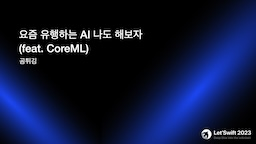

# 요즘 유행하는 AI 나도 해보자 (feat. CoreML)

[Let's Swift 2023](https://letswift.kr/2023) 발표 자료

### Why CoreML?

- 향상된 사용자 경험 제공
- 실시간으로 대응되는 빠른 반응
- 개인 데이터의 외부 유출로부터 안전
- 오프라인에서도 동작
- 모바일 장치들의 성능이 향상

## Projects

### [NaturalLanguage](/NaturalLanguage/README.md)
- NaturalLanguage 프레임워크 사용해보기

### [Big Eye (왕눈이)](/BigEye/README.md)
- 사진에서 글자 추출

### [ParkBirdie (찍새)](/ParkBirdie/README.md)
- Object Detection
- 국립공원 안에서 찍은 사진인지 감지
- 사진에 새가 찍혔는지 감지

### [DailyLog (오늘의일기)](/DailyLog/README.md)
- Text Classification
- 입력된 텍스트의 감정(긍정/부정) 분류

### [ColotFit (깔맞춤)](/ColotFit/README.md)
- 흑백이미지를 컬러 사진으로 변경
## Resources

### Slide

- [Slideshare](https://www.slideshare.net/ChiwonSong/ai-feat-coreml)

### Video

- [Youtube](https://www.youtube.com/watch?v=UzLyavMqwtI)

## References
- [Machine Learning
](https://developer.apple.com/kr/machine-learning)
- [CreateML](https://developer.apple.com/kr/machine-learning/create-ml/)
- [CoreML](https://developer.apple.com/kr/machine-learning/core-ml/)
- [CoreML Models](https://developer.apple.com/kr/machine-learning/models/)
- [Huggingface](https://huggingface.co/)
- [Exporters](https://github.com/huggingface/exporters)
- [SwiftTransformers](https://github.com/huggingface/swift-transformers)
